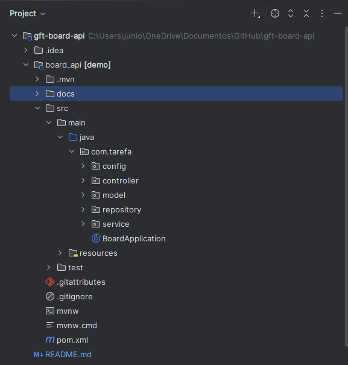
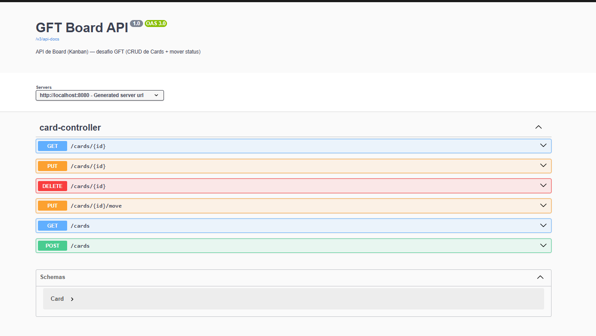
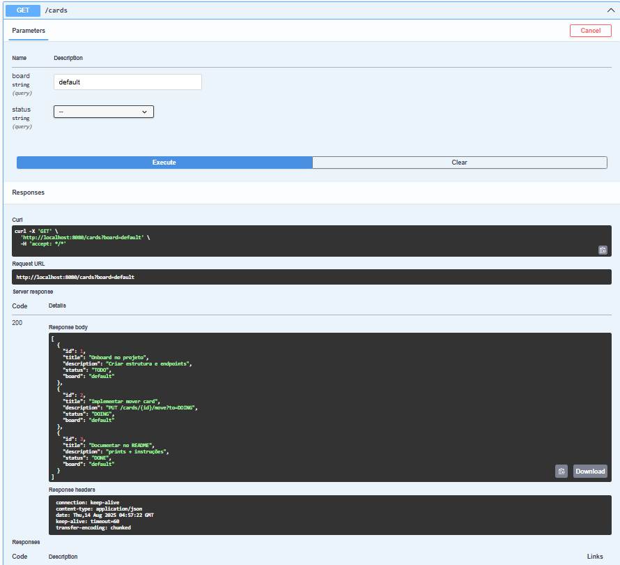
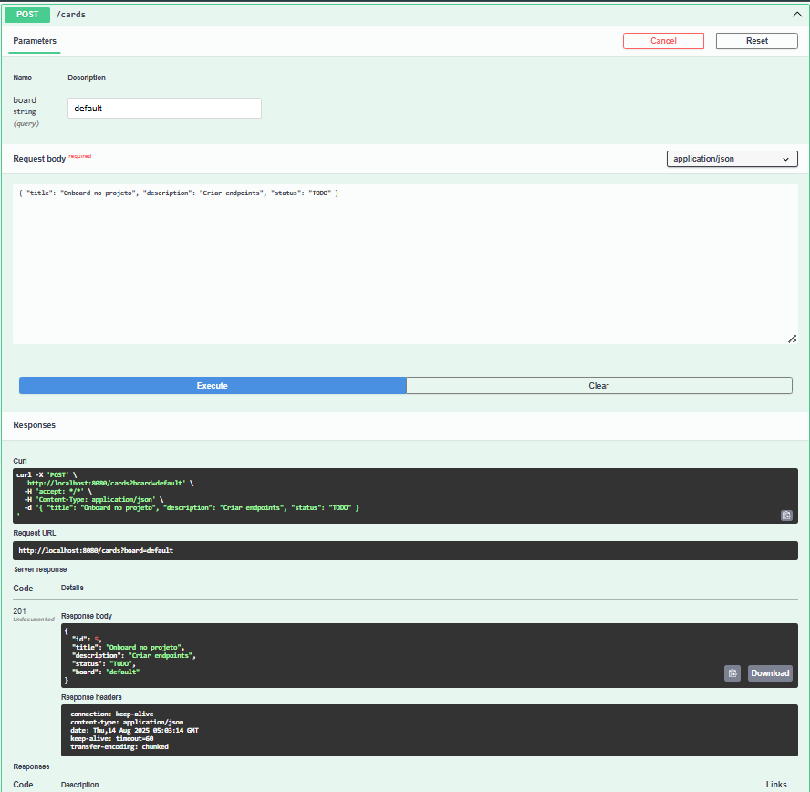
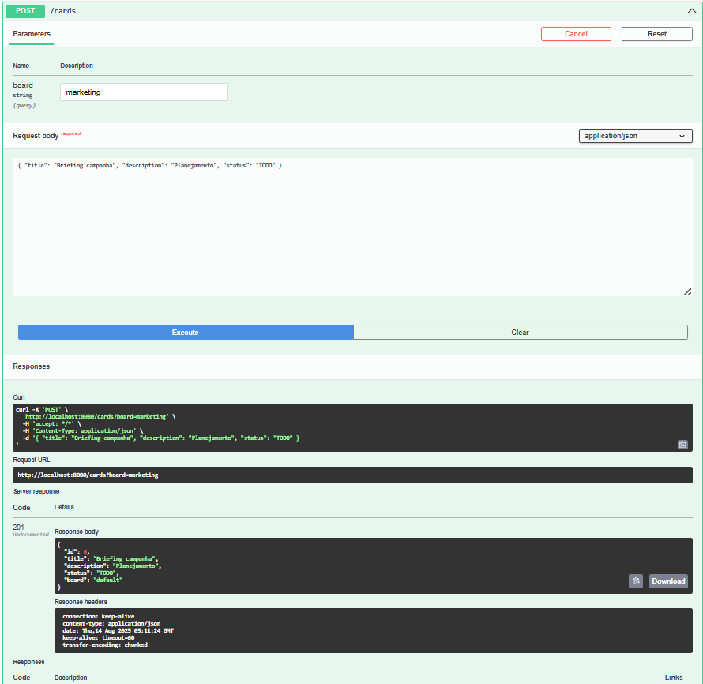
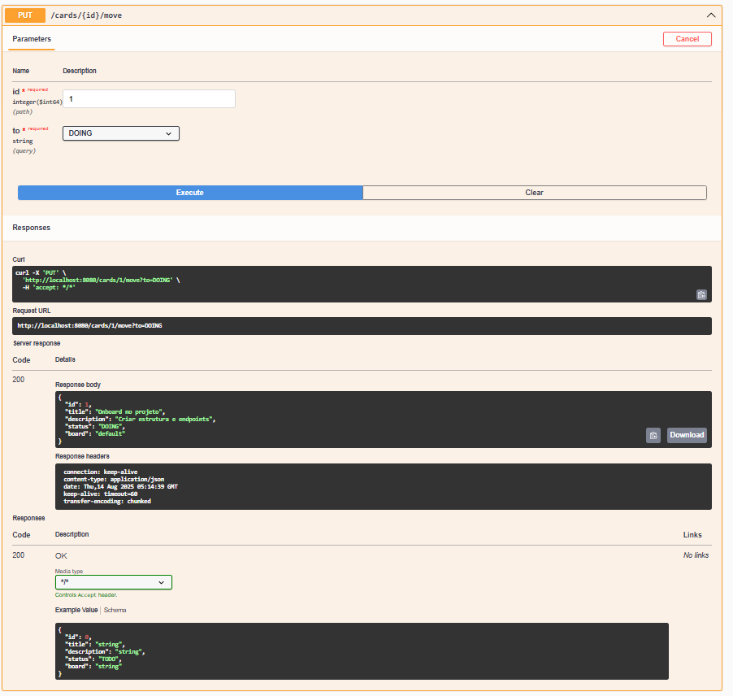
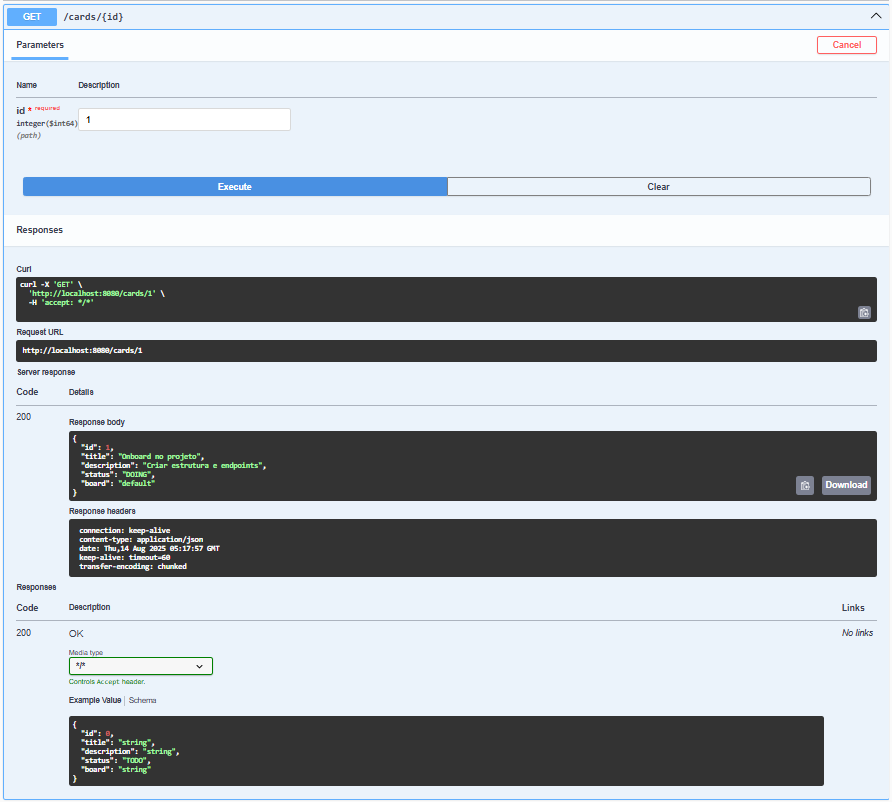
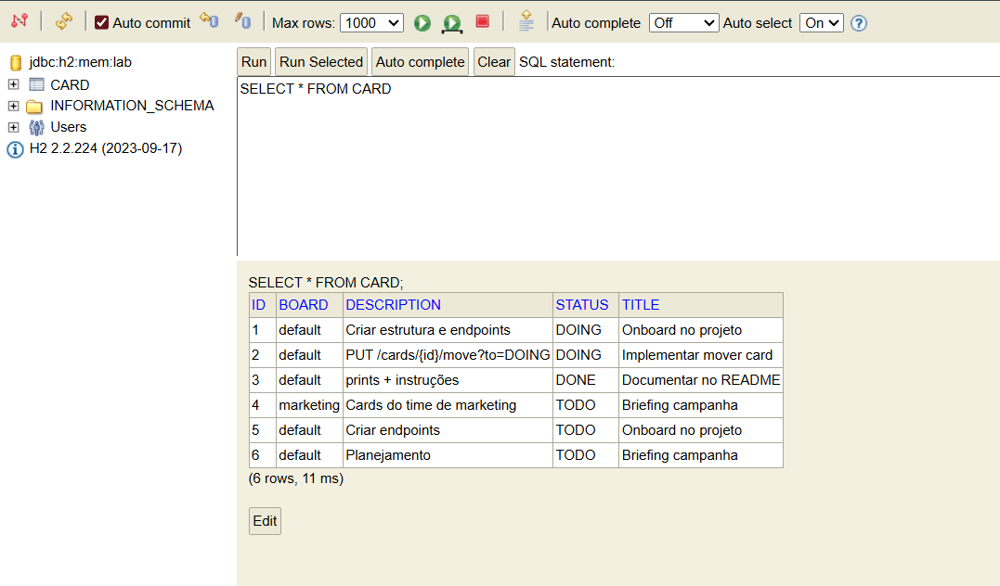

# GFT Board API — Desafio de Projeto

API REST simples para gerenciar **cards** de um board estilo Kanban (TODO → DOING → DONE).  
Entrega adaptada para o **Bootcamp GFT**, mantendo tudo **enxuto** e fiel ao conteúdo da aula.

> **Baseado** no projeto da DIO: https://github.com/digitalinnovationone/board

---

## Como executar

### Maven
```bash
./mvnw spring-boot:run
```

Acesse:
- **Swagger UI:** http://localhost:8080/swagger-ui.html  
- **H2 Console:** http://localhost:8080/h2-console  
  JDBC: `jdbc:h2:mem:lab` • User: `sa` • Password: *(vazio)*

---

## Evidências (prints)

**01 — Estrutura do projeto**  
Pacotes controller, service, repository, model, config e resources.  


**02 — Swagger UI**  
Documentação automática com o título *GFT Board API*.  


**03 — Listar cards (board=default)**  
GET `/cards?board=default`.  


**04 — Criar card**  
POST `/cards?board=default` com body `{ "title": "...", "description": "...", "status": "TODO" }`.  


**05 — Listar cards (board=marketing)**  
GET `/cards?board=marketing`.  


**06 — Mover card**  
PUT `/cards/{id}/move?to=DOING`.  


**07 — Buscar por id**  
GET `/cards/{id}`.  


**08 — H2: tabela CARD**  
Consulta no H2 mostrando os registros de cards.  



---
## Modelo de domínio

**Card**
- `id: Long`
- `title: String` *(obrigatório, até 120 chars)*
- `description: String` *(até 500 chars)*
- `status: TODO | DOING | DONE` *(padrão: TODO)*
- `board: String` *(padrão: "default", identifica o quadro)*

> O “Board” é um **rótulo** no card (`board`), permitindo múltiplos quadros sem nova entidade.

---

## Endpoints

- **GET `/cards`** — lista cards do board `default`
- **GET `/cards?board={board}`** — lista cards de um board específico
- **GET `/cards?board={board}&status=TODO|DOING|DONE`** — lista cards por board e status
- **GET `/cards/{id}`** — busca por id
- **POST `/cards?board={board}`** — cria card no board informado (ou `default` se omitido)
  ```json
  { "title": "Novo card", "description": "texto opcional", "status": "TODO" }
  ```
- **PUT `/cards/{id}`** — atualiza título/descrição/status/board
- **PUT `/cards/{id}/move?to=TODO|DOING|DONE`** — move o card entre colunas
- **DELETE `/cards/{id}`** — remove

Códigos de resposta:
- `201 Created` (criação)
- `200 OK` (consultas/atualizações)
- `204 No Content` (remoção)
- `400 Bad Request` (validação)
- `404 Not Found` (não encontrado)

---

## Tecnologias

Java • Spring Boot • Spring Web • Spring Data JPA • H2 • Bean Validation • Springdoc OpenAPI (Swagger UI)

---

## Dados de exemplo (opcional)

Se existir `src/main/resources/data.sql`, a API sobe com alguns cards de exemplo para facilitar testes (board `default` e `marketing`).

---

## Notas

- Projeto **intencionalmente simples** para o desafio (sem Docker, segurança, etc.).  
- Banco **em memória**: os dados se perdem ao reiniciar (ideal para avaliação).  
- Swagger exibe **GFT Board API** no topo (OpenAPI config).

---

## Autor

**Reginaldo**  
GitHub: https://github.com/reginaldojr-dev  
LinkedIn: https://www.linkedin.com/in/reginaldo-junior-175148188/
