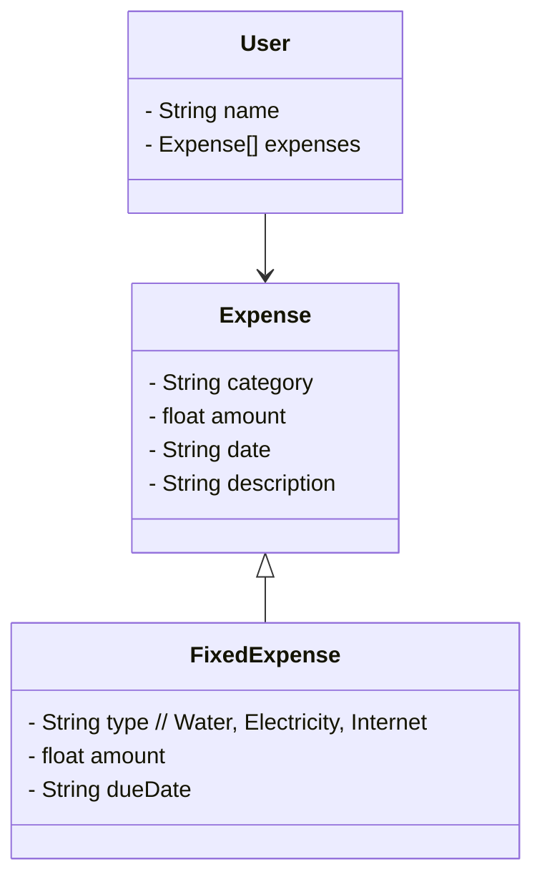

# Avanade Decola Tech 2025
# Projeto de Controle de Despesas

Java RESTful API criada para o Decola Tech Avanade 2025.

## Diagrama de Classes



## 📌 Descrição
Este projeto é uma API desenvolvida em **Java com Spring Boot** para gerenciar usuários e suas despesas fixas. A aplicação permite o cadastro de usuários, o registro de despesas por categoria e o cálculo do total de gastos.

## 🚀 Tecnologias Utilizadas
- **Java 17**
- **Spring Boot 3.x**
- **Spring Data JPA** (Hibernate)
- **Spring Web** (REST API)
- **Banco de Dados H2 / PostgreSQL**
- **Swagger (Springdoc OpenAPI)**
- **Maven**

## 📂 Estrutura do Projeto
```
avanade/
├── src/
│   ├── main/java/br/com/avanade/
│   │   ├── controller/
│   │   │   ├── UserController.java
│   │   │   ├── FixedExpenseController.java
│   │   ├── model/
│   │   │   ├── User.java
│   │   │   ├── FixedExpense.java
│   │   ├── repository/
│   │   │   ├── UserRepository.java
│   │   │   ├── FixedExpenseRepository.java
│   │   ├── service/
│   │   │   ├── UserService.java
│   │   │   ├── FixedExpenseService.java
│   ├── resources/
│   │   ├── application.properties
```

## 🔧 Funcionalidades Implementadas
✅ **Cadastro de Usuário** (`POST /users`)
- Permite criar um usuário informando um nome.

✅ **Listagem de Usuários** (`GET /users` e `GET /users/{id}`)
- Recupera todos os usuários ou um usuário específico pelo ID.

✅ **Exclusão de Usuário** (`DELETE /users/{id}`)
- Remove um usuário e suas despesas associadas.

✅ **Cadastro de Despesas Fixas** (`POST /fixed-expenses`)
- Registra uma despesa fixa associada a um usuário.
- Exemplo de JSON para cadastrar uma despesa:
```json
{
  "category": "Aluguel",
  "amount": 1500.00,
  "description": "Aluguel do mês",
  "user": {
    "id": 1
  }
}
```

✅ **Listagem de Despesas** (`GET /fixed-expenses`)
- Retorna todas as despesas registradas no sistema.

✅ **Cálculo de Total por Categoria**
- O método `getTotalByCategory(String category)` na classe `User` calcula o total gasto em uma categoria específica.

✅ **Swagger Documentação da API**
- Disponível em: `http://localhost:8080/swagger-ui.html`

## 🛠 Como Rodar o Projeto
1. **Clone o repositório**:
   ```sh
   git clone https://github.com/seu-usuario/seu-repositorio.git
   ```
2. **Entre na pasta do projeto**:
   ```sh
   cd avanade
   ```
3. **Compile e rode o projeto com Maven**:
   ```sh
   mvn spring-boot:run
   ```
4. **Acesse a API pelo Swagger**:
    - Abra `http://localhost:8080/swagger-ui.html` no navegador.

## 🛠 Ajustes Feitos
- Correções no `UserService` e `FixedExpenseService` para garantir que apenas usuários existentes possam ser referenciados nas despesas.
- Ajuste da entidade `User` para corrigir erro de `Detached entity with generated id`.
- Melhorias na estrutura de relacionamento entre `User` e `FixedExpense`.
- Adição do Swagger para documentação da API.


