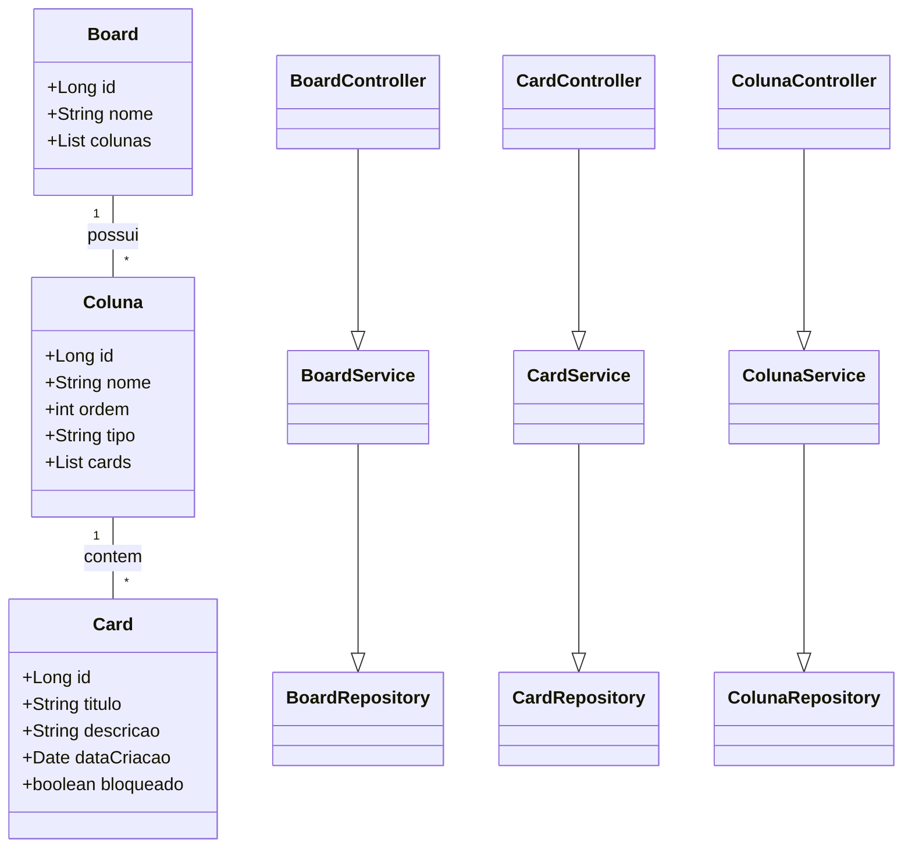

# Board Management API

## Descrição
Este é um projeto de API REST para gerenciar boards, colunas e cards para o bootcamp Decola Tech Avanade 2025. A API permite criar, atualizar e manipular boards seguindo regras predefinidas para a gestão de tarefas.

## Tecnologias Utilizadas
- **Java**
- **Spring Boot**
- **Spring Data JPA**
- **MySQL**
  

## Estrutura do Projeto
O projeto segue a arquitetura em camadas:
- **controller/**: Contém os controladores REST da API (BoardController, CardController, ColunaController).
- **model/**: Contém as entidades do banco de dados (Board, Card, Coluna).
- **repository/**: Contém as interfaces de acesso aos dados (BoardRepository, CardRepository, ColunaRepository).
- **service/**: Contém a lógica de negócio e regras para manipulação dos dados (BoardService, CardService, ColunaService).

## Diagrama da Estrutura


## Regras do Board
1. Um board deve ter um nome e ser composto por pelo menos 3 colunas:
   - Uma coluna inicial (onde o card é colocado inicialmente).
   - Uma coluna para tarefas concluídas.
   - Uma coluna para cards cancelados.
   - A nomenclatura das colunas é livre.
2. As colunas possuem:
   - Nome, ordem dentro do board e tipo (Inicial, Cancelamento, Final e Pendente).
3. Restrições sobre colunas:
   - Um board pode ter **apenas uma** coluna de cada tipo: Inicial, Cancelamento e Final.
   - Colunas do tipo Pendente podem existir em qualquer quantidade.
   - A coluna Inicial deve ser a **primeira**.
   - A coluna Final deve ser a **penúltima**.
   - A coluna de Cancelamento deve ser a **última**.
4. Os cards possuem:
   - Título, descrição, data de criação e status de bloqueio.
5. Movimentação dos cards:
   - Cards seguem a ordem das colunas no board, **sem pular etapas**.
   - Um card pode ser movido diretamente para a coluna de cancelamento a partir de qualquer outra, exceto a coluna Final.
6. Cards bloqueados:
   - Não podem ser movidos até serem desbloqueados.
   - Para bloquear um card, é necessário fornecer um motivo.
   - Para desbloqueá-lo, também é necessário um motivo.

## Menu de Manipulação do Board
O sistema permite as seguintes operações:
- Criar um card.
- Mover um card para a próxima coluna.
- Cancelar um card.
- Bloquear um card.
- Desbloquear um card.
- Fechar o board.

## Como Executar o Projeto
1. Clone o repositório:
   ```sh
   git clone <URL_DO_REPOSITORIO>
   cd <NOME_DO_PROJETO>
   ```
2. Execute a aplicação com o Spring Boot:
   ```sh
   ./mvnw spring-boot:run
   ```
3. A API estará disponível em:
   ```sh
   http://localhost:8080
   ```

## Endpoints Principais
### BoardController
- **Criar um board**: `POST /boards`
- **Listar todos os boards**: `GET /boards`
- **Buscar board por ID**: `GET /boards/{id}`
- **Fechar um board**: `PUT /boards/{id}/fechar`

### CardController
- **Criar um card**: `POST /cards`
- **Mover um card**: `PUT /cards/{id}/mover`
- **Cancelar um card**: `PUT /cards/{id}/cancelar`
- **Bloquear um card**: `PUT /cards/{id}/bloquear`
- **Desbloquear um card**: `PUT /cards/{id}/desbloquear`

### ColunaController
- **Criar uma coluna**: `POST /colunas`
- **Listar colunas de um board**: `GET /boards/{id}/colunas`

## Considerações Finais
Este projeto implementa um sistema de gestão de tarefas em um board, permitindo a manipulação de cards e colunas de acordo com regras predefinidas. 

Contribuições e melhorias são bem-vindas!

