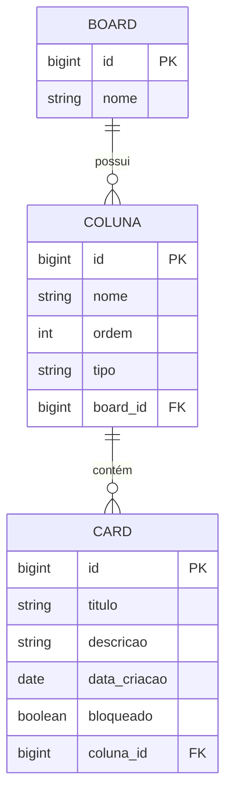

# Board de Tarefas - Sistema de Gestão de Tarefas

## 📌 Sobre o Projeto
Este projeto é um sistema de **Gestão de Tarefas** feito para o bootcamp Decola Tech Avanade 2025, onde é possível criar e gerenciar **Boards**, **Colunas** e **Cards**. O sistema permite movimentar cards entre colunas seguindo regras definidas, bloqueá-los, desbloqueá-los e gerar relatórios.

## 🚀 Tecnologias Utilizadas
- **Java** (Spring Boot)
- **Spring Data JPA**
- **MySQL**
- **Maven**


## 📂 Estrutura do Projeto

```
com.tarefa
│── model          # Entidades do banco de dados
│── repository     # Repositórios JPA
│── service        # Lógica de negócio
│── controller     # Endpoints REST
│── config         # Configurações do banco de dados
```

## 🛠 Configuração do Banco de Dados
Adicione as configurações no `application.properties`:

```properties
spring.datasource.url=jdbc:mysql://localhost:3306/board_db
spring.datasource.username=root
spring.datasource.password=senha
spring.jpa.hibernate.ddl-auto=update
spring.jpa.properties.hibernate.dialect=org.hibernate.dialect.MySQL8Dialect
```

## 📊 Modelo de Dados (Diagrama Mermaid)



## 🔧 Como Executar o Projeto
1. Clone o repositório:
   ```sh
   git clone https://github.com/reginaldojr-dev/avanade.git
   ```
2. Configure o banco de dados MySQL
3. Compile e execute:
   ```sh
   mvn spring-boot:run
   ```
4. Acesse os endpoints via Postman ou navegador (`http://localhost:8080`)

## 📌 Funcionalidades
✅ Criar Boards com colunas e cards  
✅ Mover cards entre colunas  
✅ Bloquear e desbloquear cards  
✅ Gerar relatórios de movimentação  
✅ Persistência dos dados no MySQL

## Considerações Finais

Este projeto implementa um sistema de gestão de tarefas em um board, permitindo a manipulação de cards e colunas.

Contribuições e melhorias são bem-vindas!